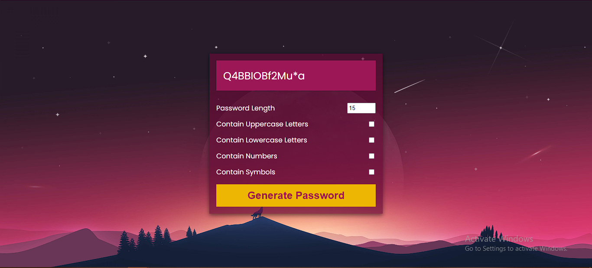

# Password Generator

This is a simple Password Generator web application that allows users to generate random passwords based on their preferred length and character types.

## Technologies Used

- HTML
- CSS
- JavaScript

## Features

- Generate random passwords with various character types.
- Customize the length of the generated password.
- Copy the generated password to the clipboard for easy use.

## Getting Started

To run this Password Generator locally, follow these steps:

1. Clone the repository to your local machine

2. Navigate to the project directory:

3. Open the `index.html` file in your preferred web browser.

## Usage

1. Select the desired options for the generated password:
- **Password Length:** Use the number input field to specify the length of the password.
- **Character Types:** Check the corresponding checkboxes to include uppercase letters, lowercase letters, numbers, and symbols in the password.

2. To copy the generated password to the clipboard, click the "Copy" button.

